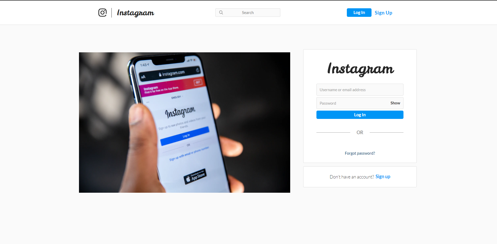
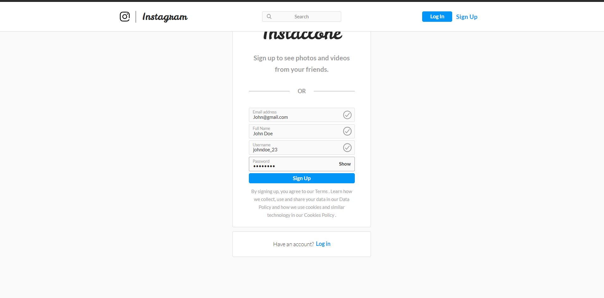
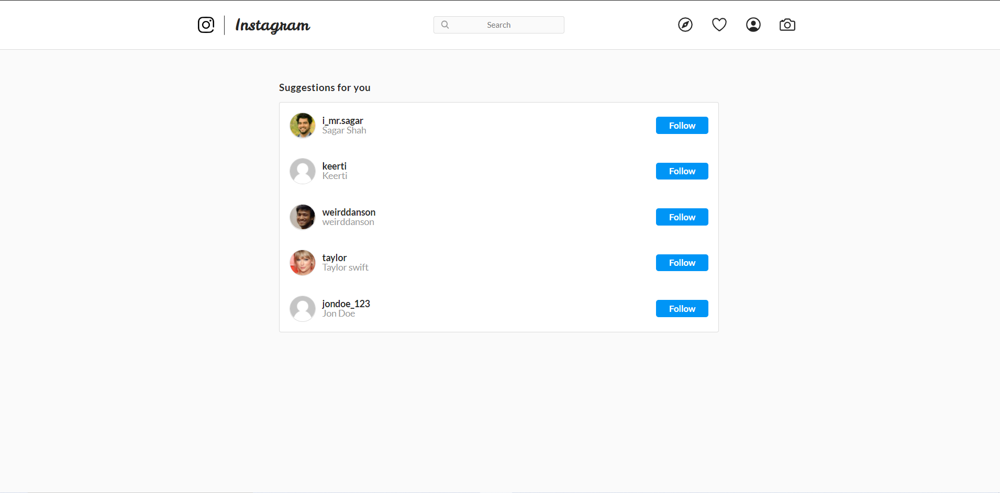
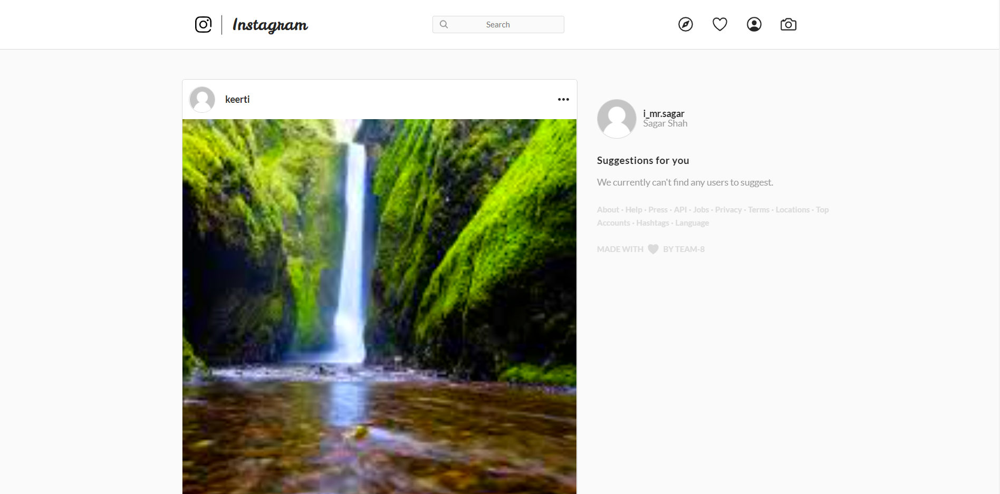
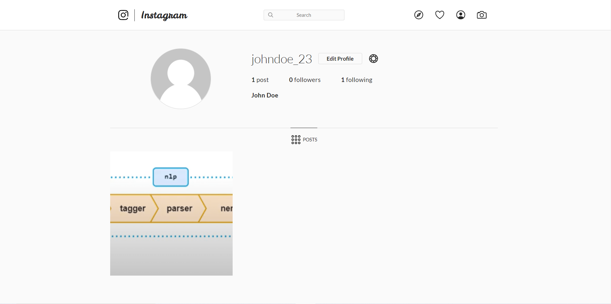
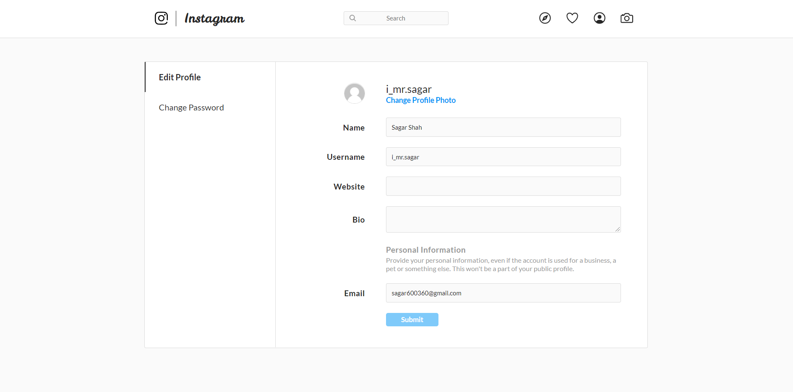
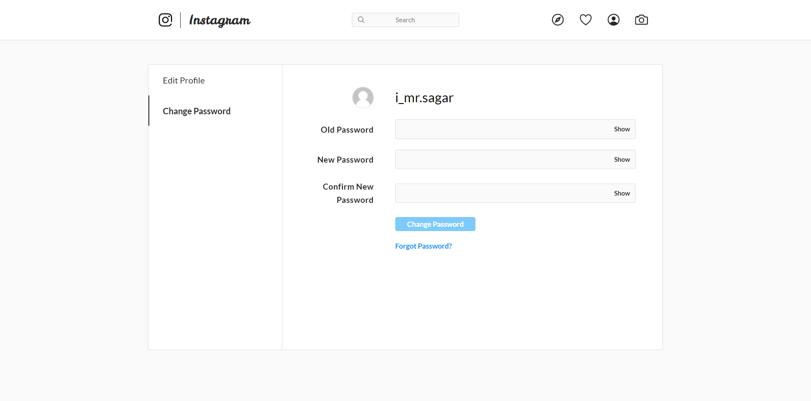
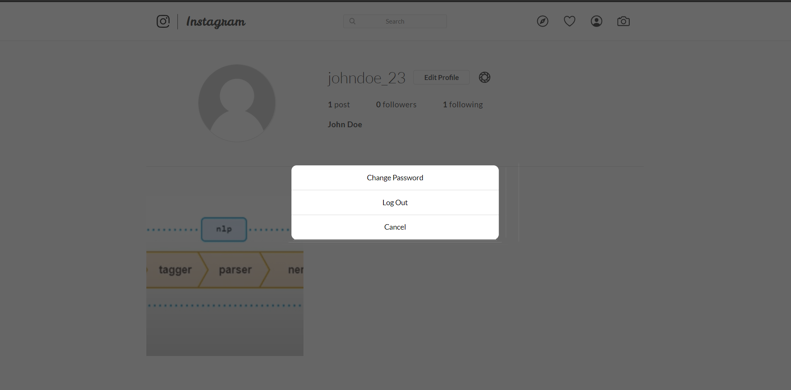

# Instagram

> An instagram application created with MongoDB, Express, React

## Installation


### Clone

- Clone this repo to your local machine using `https://github.com/neu-mis-info6150-fall-2020/final-project-group-8`

### Setup

> Install npm dependencies using npm install

```shell
$ npm install && cd webapp && npm install
```

> Set up a MongoDB database either locally or provision a free database with <a href='https://www.mongodb.com/cloud/atlas'>`MongoDB Atlas`</a>

> In the root directory run both the backend and the front end with the following command

```shell
$ npm run dev
```

The app should launch automatically

## Checkout the overview of various features implemented of the running application below :-

### Login page of the application


### Signup page of the application


### Suggestion page of the application


### Home page of the application


### Displaying Users profile created using the application


### You can also edit your profile details


### Password can be changed as shown below


### Logout feature to exit the application



### TEAM
- Sapna patel
- Hemant jain
- Sagar shah
- Keerti Ojha